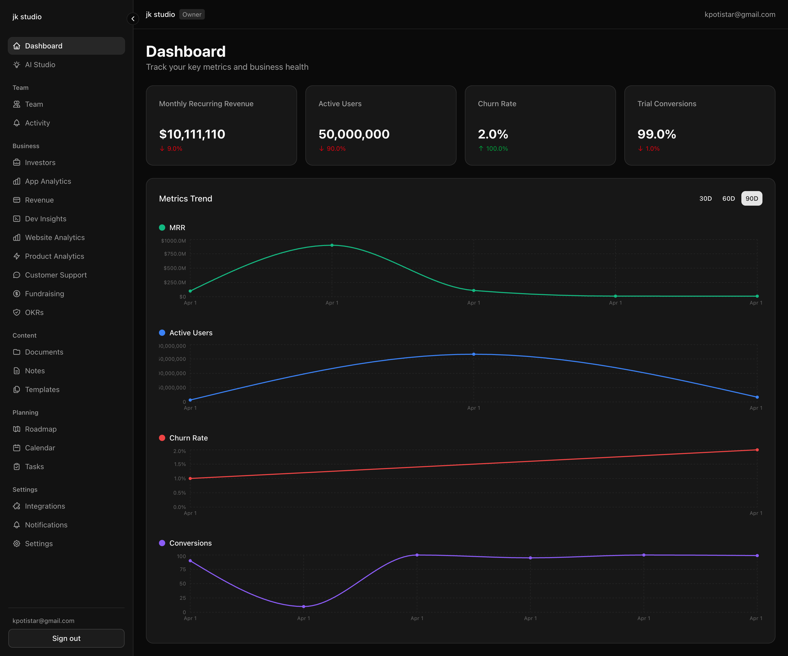

# Founderboard AI

Founderboard AI is a founder operating system built with Next.js, Firebase, and OpenAI. It combines company planning, documents, investor tracking, analytics, integrations, and AI workflows in a single dashboard.



## What it includes

- Dashboard and organization workspace
- AI Studio for guided founder workflows
- App Analytics, Website Analytics, Product Analytics, Revenue, and Dev Insights
- Investor pipeline and fundraising tracking
- Documents, notes, templates, roadmap, calendar, tasks, OKRs, and activity
- Live third-party integrations including App Store Connect, GitHub, Google Analytics, Stripe, Slack, Notion, Linear, Intercom, and PostHog

## Stack

- Next.js 16
- React 19
- TypeScript
- Firebase Auth, Firestore, and Storage
- Firebase Admin SDK
- Tailwind CSS 4
- Radix UI primitives
- OpenAI SDK
- Upstash Redis

## Getting started

1. Install dependencies:

```bash
npm install
```

2. Copy the example environment file and fill in your credentials:

```bash
cp .env.example .env.local
```

3. Start the development server:

```bash
npm run dev
```

4. Open [http://localhost:3000](http://localhost:3000).

## Environment variables

The project expects these groups of variables in `.env.local`:

- Firebase client:
  - `NEXT_PUBLIC_FIREBASE_API_KEY`
  - `NEXT_PUBLIC_FIREBASE_AUTH_DOMAIN`
  - `NEXT_PUBLIC_FIREBASE_PROJECT_ID`
  - `NEXT_PUBLIC_FIREBASE_STORAGE_BUCKET`
  - `NEXT_PUBLIC_FIREBASE_MESSAGING_SENDER_ID`
  - `NEXT_PUBLIC_FIREBASE_APP_ID`
- Firebase admin:
  - `FIREBASE_ADMIN_PROJECT_ID`
  - `FIREBASE_ADMIN_CLIENT_EMAIL`
  - `FIREBASE_ADMIN_PRIVATE_KEY`
  - `FIREBASE_STORAGE_BUCKET` optional, but recommended for server-side Storage access
- AI:
  - `OPENAI_API_KEY`
- Rate limiting:
  - `UPSTASH_REDIS_REST_URL`
  - `UPSTASH_REDIS_REST_TOKEN`

See [.env.example](./.env.example) for the current template.

## Available scripts

```bash
npm run dev
npm run build
npm run start
npm run lint
```

## Project structure

```text
src/app                    App Router pages and layouts
src/components/features    Product feature UIs
src/components/ui          Shared UI primitives
src/lib/actions            Server actions
src/lib/firebase           Firebase client and admin setup
src/types                  Shared schemas and domain types
public                     Static assets
```

## Notes

- Documents upload to Firebase Storage and store metadata in Firestore.
- Several analytics surfaces now fetch live provider data instead of relying on Firestore snapshots.
- Product Analytics uses PostHog.

## License

[MIT](./LICENSE)
